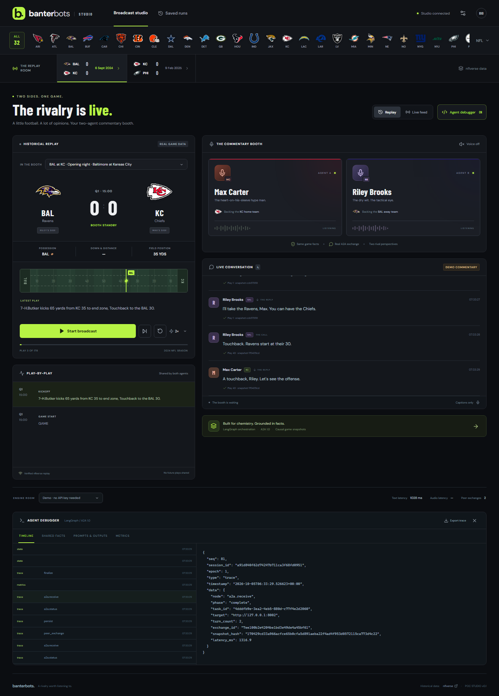

# BanterBots

Two NFL commentators. Opposing loyalties. One shared game stream.

BanterBots is a local React/Python POC with LangGraph orchestration and **real A2A protocol 1.0 HTTP communication** between independently addressable team agents. The dashboard includes all 32 teams, scores, game state, commentary, speech, and an inspectable run journal.



## Start on Windows

Install Python 3.12+ and Node.js 24+. From this folder:

```powershell
python tools/setup.py
python tools/dev.py
```

Open **http://localhost:5173**. Setup installs the locked dependencies into `.venv` and builds the frontend. The launcher uses `npm.cmd`, so PowerShell script execution policy does not need changing. Ctrl+C stops the services it started.

To run the built dashboard without Vite:

```powershell
python tools/dev.py --no-frontend
```

Then open **http://localhost:8000**. API documentation is at http://localhost:8000/docs.

| Service | Address |
|---|---|
| Dashboard development server | http://localhost:5173 |
| Coordinator / API | http://localhost:8000 |
| Max Carter / Team A | http://localhost:8001/.well-known/agent-card.json |
| Riley Brooks / Team B | http://localhost:8002/.well-known/agent-card.json |

## Repeatable demonstration

1. Keep **Historical replay** and **Demo commentary** selected. No credentials or live game are needed.
2. Select Baltimore at Kansas City (September 5, 2024).
3. Use **Step** to process one play, then open the debugger. Both agents receive the same snapshot hash; the lead makes a direct A2A request to its peer.
4. Step again to see the other agent take the lead, or press **Play** for a paced replay.
5. Turn on speech after interacting with the page. Demo speech uses the browser's available voices; quality and voice availability depend on the device. Muting preserves the written conversation.
6. Inspect prompts, outputs, protocol tasks, event facts, errors, and timings. Export the run JSON for investigation.
7. Pause, restart, switch games, or reopen a saved run. Saved history is displayed without automatically regenerating or speaking old turns.

The replay uses real nflverse plays. Demo commentary is deterministic, event-grounded dialogue through the same LangGraph and A2A services as OpenAI mode. It demonstrates the application workflow; model-driven naturalness requires the credentialed review below.

## Add OpenAI later

Copy `.env.example` to `.env`, add your key, and restart all services:

```dotenv
OPENAI_API_KEY=your_project_key
OPENAI_TEXT_MODEL=gpt-6-luna
OPENAI_VOICE_MODEL=gpt-live-1
```

Select **OpenAI commentary** in the dashboard. The text model prepares short factual calls and replies. Your requested `gpt-live-1` delivers the spoken commentary through the server. Keys stay on the Python services.

Personas are editable manifests under `personas/`. Max supports the home team; Riley supports the away team. The personalities use original identities and distinct stock voices.

GPT-Live uses fresh sessions for bounded utterances. The next agent receives the lead's finalized observed speech transcript. The browser serializes audio segments and acknowledges playback. Caption timing is approximate, and streamed speech may paraphrase a draft. Once credentials are configured, listen to representative scoring, turnover, penalty, reversed-play and quiet-period examples before presenting model-driven broadcast quality.

## Live games

Select **Live ESPN** to load the current scoreboard. Pick a game and start the booth. The adapter polls scores every 15 seconds and selected-game play-by-play every 5 seconds, deduplicates IDs, and notices revised plays. Joining a game starts from its current context and latest play.

ESPN's endpoints are unofficial and best effort. The UI reports connection health, last successful poll, and provider errors. Halftime and a quiet field do not mean the feed disconnected. A failed live connection stays visibly failed; changing to historical replay is explicit.

Measure **feed delay**, **ingestion-to-first-text**, **ingestion-to-first-audio**, and exchange duration separately. A polling provider cannot guarantee commentary within 2.5 seconds of the actual snap.

## Checks

```powershell
.\.venv\Scripts\python.exe -m pytest -q
.\.venv\Scripts\python.exe -m ruff check backend tools tests
cd frontend
npm.cmd run check
npm.cmd run build
npm.cmd exec playwright install chromium
npm.cmd run test:browser
```

Backend checks cover causal scores, reversed rulings, provider deduplication/corrections, shared snapshots, protocol exchanges, cancellation, and speech boundaries. Credential-free CI exercises the demo and protocol contracts. Live provider availability and actual OpenAI speech require explicit smoke checks.

The browser checks use a fresh, isolated headless Chromium profile against the running services on port 8000. They verify desktop and mobile layout, the 32 team icons, actual A2A lead alternation, the debugger, restart, and an explicit live-feed failure.

With the services running, verify actual HTTP peer communication:

```powershell
.\.venv\Scripts\python.exe tools/smoke.py
```

This creates a fresh silent demo run, single-steps two plays, and checks lead alternation, identical snapshot hashes, peer reply linkage, and separate A2A task IDs.

## Debugging

- The integrated debugger shows observable workflow steps, factual context, requests, responses, prompts, and output.
- `.runtime/journal.sqlite` holds sessions and run events. Separate checkpoint/task databases support LangGraph and the A2A services.
- Audio chunks are transient; transcripts and segment metadata are saved. Reconnecting recovers written history without replaying old sound.
- Reset, stop, and game changes increment the run epoch, cancel outstanding work, and discard late messages/audio.
- Optional LangSmith tracing is configured in `.env.example`; local tracing works without an account.

See [architecture](docs/ARCHITECTURE.md), [data attribution](data/README.md), and the three original Word documents in `docs/`.

## Research references

- [nflverse historical play-by-play](https://github.com/nflverse/nflverse-data/releases/tag/pbp) and [data update schedule](https://nflreadr.nflverse.com/articles/nflverse_data_schedule.html).
- [Kaggle cleaned historical play-by-play example](https://www.kaggle.com/datasets/prestongrinstead/nfl-play-by-play-2015-2025-cleaned).
- [A2A Python SDK](https://github.com/a2aproject/a2a-python) and [LangGraph](https://docs.langchain.com/oss/python/langgraph/overview).
- [OpenAI GPT-Live](https://developers.openai.com/api/docs/guides/live) and [session controls](https://developers.openai.com/api/docs/guides/live-conversations).
- [ESPN/ManningCast production discussion](https://espnpressroom.com/feature/teamwork-in-action-monday-night-football-with-peyton-and-eli-espn-and-omaha-productions/) and [Ably commentary prototype](https://github.com/ably-labs/football-data-live-ai-commentary) informed interaction and UI design. Their code is not copied.
