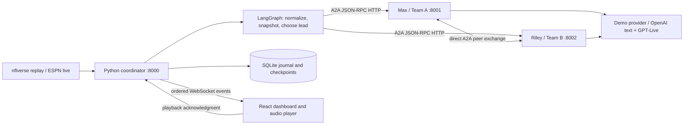

# Broadcast architecture

## Causality

Provider events have an identity, sequence, and revision. Each commentary exchange seals a snapshot containing only the current event, recent observed plays and previously emitted commentary. Both agents receive the same snapshot hash. Team allegiance changes interpretation, never the recorded outcome.

Historical final-score columns are excluded. Post-play totals drive the scoreboard. Descriptions that contain a subsequently reversed touchdown are interpreted with normalized ruling flags. New live scores cannot mutate an already active exchange.

## Genuine agent communication

Each agent publishes an Agent Card at `/.well-known/agent-card.json` and implements protocol 1.0 JSON-RPC at `/a2a/jsonrpc` using the official SDK. Task lifecycle events move from submitted to working, artifact updates, and a terminal status. Agent task state is persisted.

The coordinator calls the lead's `exchange` mode. The lead generates its own call and then invokes the peer's `reply` mode over HTTP with the same snapshot and its observed utterance. A hop budget of one prevents recursive delegation. The lead alternates each completed exchange. The debugger records both coordinator-to-agent and agent-to-peer protocol traffic.

## Output and playback

Demo mode generates deterministic event-grounded lines and uses browser speech. OpenAI mode prepares a grounded draft through Responses and creates a fresh GPT-Live session for that utterance. The Python server relays PCM16 at 24 kHz and actual transcript deltas as A2A artifacts, which the coordinator forwards over the dashboard WebSocket.

Speech generation and audience playback have separate ownership. The lead's closed session seals its observed transcript before the peer generates a reply. Peer audio can arrive while the lead is playing; the browser queues it until the lead's final sample plays. The coordinator uses playback acknowledgment to pace replay without holding an A2A task open indefinitely.

Application silence detection provides a candidate speech boundary; it is not a provider turn-complete event. Closure tails remain part of the sealed segment. Capped, interrupted or unconfirmed-finalization segments are labelled. The actual account integration must be checked after credentials are supplied.

## Persistence, recovery and pressure

The journal saves snapshots, transcript turns, observable traces, and metrics. Large raw audio blobs are not saved. Reopening runs displays captured results; a new replay or restarted run explicitly generates new output.

Run events carry a sequence and epoch. Reconnect uses a cursor and marks recovered events historical, preventing repeated speech. Pausing/resetting/stopping invalidates in-flight work; game switching also clears queued audio. Slow browser streams disconnect and recover history instead of dropping arbitrary audio samples.

Live polling continues while a commentary exchange runs. Routine backlog is coalesced; important scoring, turnover, penalty and correction events are retained. Poll success and latest-play age are separate signals. No automatic live-to-replay substitution occurs.

## API contracts

- `GET /api/config`, `/api/teams`, `/api/games?mode=replay|live&date=YYYYMMDD`, `/api/health`.
- `POST /api/sessions` creates a paused broadcast with game, source, commentary provider, speed and voice settings.
- `POST /api/sessions/{id}/control` accepts play, pause, step, restart, stop or speed.
- `GET /api/sessions`, `/api/sessions/{id}`, `/api/sessions/{id}/export` inspect saved and current runs.
- `WS /api/sessions/{id}/stream?since={seq}` carries typed snapshots, turns, captions, audio, segment seals, state, feed status, traces and metrics. Clients send `playback.ack`.

Pydantic contracts in `backend/contracts.py` are the source of truth. Default deployment binds all services to localhost and supports one selected broadcast at a time. Public hosting, viewer authentication, video analysis and broadcast transcript ingestion are future work.
